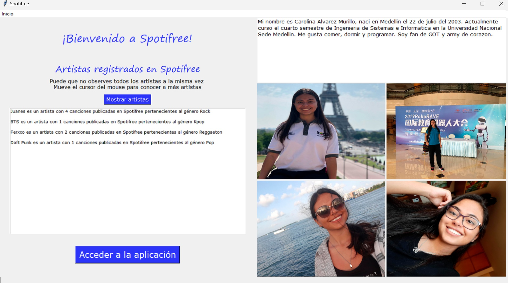
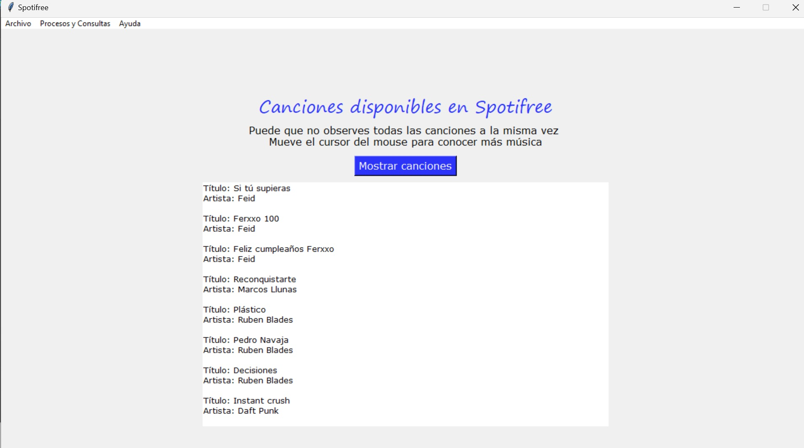
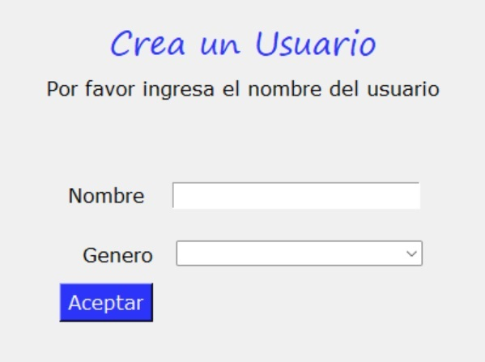

# Spotifree
Spotifree is a poo project in java and python. It´s a music app with a graphical interface. Developed in the 2022-2s Object Oriented Programming course.

| | | 
| :--: | :--: |
|  |  |
| | | 

## App visuals

|  |  |
| :--: | :--: |
|  |  |
|  |  |

## Documentation

- [Java Documentation](https://drive.google.com/file/d/1ukFn99p8ht02G2Wh_Ea_ejhWpfD03D3k/view?usp=sharing)
- [Python Documentation](https://drive.google.com/file/d/1Rd5jF2TCrUnRpy1M_55fIILhhNW0Vv93/view?usp=sharing)

## Team Members

- Carolina Álvarez Murillo: [caroAM22](https://github.com/caroAM22)
- Alejandro Orozco Ochoa: [brokie636](https://github.com/brokie636)
- Catalina Restrepo Salgado: [CatalinaRpoS](https://github.com/CatalinaRpoS)
- Tomás Rodríguez Taborda: [torodriguezt](https://github.com/torodriguezt)
- Miller Johan Chica Acero [milleracero](https://github.com/milleracero)
  
## License

This project is under the MIT License. Refer to the [LICENSE](LICENSE) file for more details.

### Thank you! 

